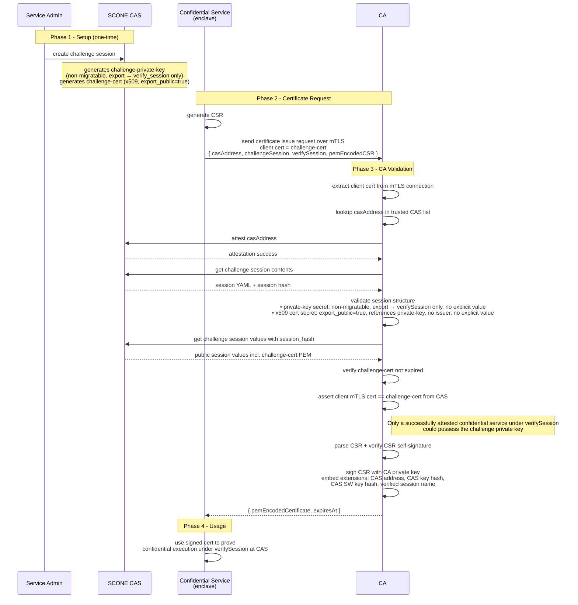

## CA Certificate Issuance Flow

```mermaid
sequenceDiagram
    participant SA as Service Admin
    participant CAS as SCONE CAS
    participant CS as Confidential Service<br/>(enclave)
    participant CA as CA

    Note over SA,CAS: Phase 1 - Setup (one-time)

    SA->>CAS: create challenge session
    Note over CAS: generates challenge-private-key<br/>(non-migratable, export → verify_session only)<br/>generates challenge-cert (x509, export_public=true)

    Note over CS,CA: Phase 2 - Certificate Request

    CS->>CS: generate CSR
    CS->>CA: send certificate issue request over mTLS<br/>client cert = challenge-cert<br/>{ casAddress, challengeSession, verifySession, pemEncodedCSR }

    Note over CA: Phase 3 - CA Validation

    CA->>CA: extract client cert from mTLS connection
    CA->>CA: lookup casAddress in trusted CAS list

    CA->>CAS: attest casAddress 
    CAS-->>CA: attestation success

    CA->>CAS: get challenge session contents
    CAS-->>CA: session YAML + session hash

    CA->>CA: validate session structure<br/>• private-key secret: non-migratable, export → verifySession only, no explicit value<br/>• x509 cert secret: export_public=true, references private-key, no issuer, no explicit value

    CA->>CAS: get challenge session values with session_hash
    CAS-->>CA: public session values incl. challenge-cert PEM

    CA->>CA: verify challenge-cert not expired
    CA->>CA: assert client mTLS cert == challenge-cert from CAS

    Note right of CA: Only a successfully attested confidential service under verifySession<br/>could possess the challenge private key

    CA->>CA: parse CSR + verify CSR self-signature
    CA->>CA: sign CSR with CA private key<br/>embed extensions: CAS address, CAS key hash,<br/>CAS SW key hash, verified session name

    CA-->>CS: { pemEncodedCertificate, expiresAt }

    Note over CS: Phase 4 - Usage

    CS->>CS: use signed cert to prove<br/>confidential execution under verifySession at CAS
```